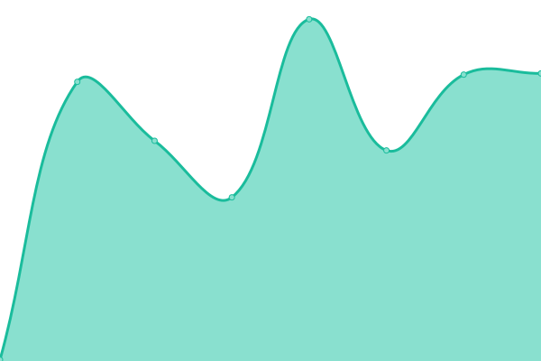

# [📈 Live Status](https://new.uptime.lebbadi.fr): <!--live status--> **🟩 All systems operational**

This repository contains the open-source uptime monitor and status page for [Romain Lebbadi-Breteau](www.lebbadi.fr), powered by [Upptime](https://github.com/upptime/upptime).

With [Upptime](https://upptime.js.org), you can get your own unlimited and free uptime monitor and status page, powered entirely by a GitHub repository. We use [Issues](https://github.com/RomainL972/uptime/issues) as incident reports, [Actions](https://github.com/RomainL972/uptime/actions) as uptime monitors, and [Pages](https://new.uptime.lebbadi.fr) for the status page.

<!--start: status pages-->
<!-- This summary is generated by Upptime (https://github.com/upptime/upptime) -->
<!-- Do not edit this manually, your changes will be overwritten -->
<!-- prettier-ignore -->
| URL | Status | History | Response Time | Uptime |
| --- | ------ | ------- | ------------- | ------ |
|  [RPI Covid](https://pi.lebbadi.fr/deplacement-covid-19/) | 🟩 Up | [rpi-covid.yml](https://github.com/RomainL972/uptime/commits/HEAD/history/rpi-covid.yml) | 

 309ms
     
 | 

<a href="https://uptime.lebbadi.fr/history/rpi-covid">58.61%</a>
    

|  [RPI Owncloud](https://pi.lebbadi.fr/owncloud/) | 🟩 Up | [rpi-owncloud.yml](https://github.com/RomainL972/uptime/commits/HEAD/history/rpi-owncloud.yml) | 

 1928ms
     
 | 

<a href="https://uptime.lebbadi.fr/history/rpi-owncloud">58.49%</a>
    

|  [RPI Transmission](https://pi.lebbadi.fr/transmission/web/) | 🟩 Up | [rpi-transmission.yml](https://github.com/RomainL972/uptime/commits/HEAD/history/rpi-transmission.yml) | 

 73ms
     
 | 

<a href="https://uptime.lebbadi.fr/history/rpi-transmission">58.13%</a>
    

|  [VPS Dashboard](https://vps.lebbadi.fr) | 🟩 Up | [vps-dashboard.yml](https://github.com/RomainL972/uptime/commits/HEAD/history/vps-dashboard.yml) | 

 514ms
     
 | 

<a href="https://uptime.lebbadi.fr/history/vps-dashboard">100.00%</a>
    

|  [VPS Questionnaire 360](https://questionnaires.gemmconseil.fr) | 🟩 Up | [vps-questionnaire-360.yml](https://github.com/RomainL972/uptime/commits/HEAD/history/vps-questionnaire-360.yml) | 

 539ms
     
 | 

<a href="https://uptime.lebbadi.fr/history/vps-questionnaire-360">100.00%</a>
    

|  [Kréyol Gym](https://www.kreyolgym.fr/) | 🟩 Up | [kreyol-gym.yml](https://github.com/RomainL972/uptime/commits/HEAD/history/kreyol-gym.yml) | 

 620ms
     
 | 

<a href="https://uptime.lebbadi.fr/history/kreyol-gym">100.00%</a>
    

|  [STEP](https://step.polymtl.ca/) | 🟩 Up | [step.yml](https://github.com/RomainL972/uptime/commits/HEAD/history/step.yml) | 

 497ms
     
 | 

<a href="https://uptime.lebbadi.fr/history/step">98.69%</a>
    

<!--end: status pages-->

[**Visit our status website →**](https://new.uptime.lebbadi.fr)

## 📄 License

- Powered by: [Upptime](https://github.com/upptime/upptime)
- Code: [MIT](./LICENSE) © [Romain Lebbadi-Breteau](www.lebbadi.fr)
- Data in the `./history` directory: [Open Database License](https://opendatacommons.org/licenses/odbl/1-0/)
